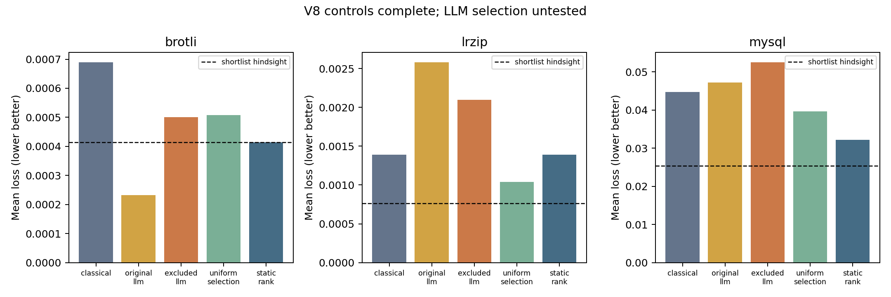

# V8 pilot: direct candidate selection

**Control stage completed; the 15 intended LLM selection cases remain untested.** The exhausted request allowance blocks inference; no LLM selection effect is reported.

This is a post-v7 exploratory development comparison on MySQL, lrzip and Brotli, five fixed seeds per family. It is not a new held-out result. A frozen acquired-label-only shortlist of20 existing unevaluated rows replaces generated feature proposals and projection. Uniform selection and static classical ranking use the same shortlist. IDs are randomly assigned before collection; the real model, if run, must select ten distinct IDs. Each branch restores the same ten-label prefix and acquires ten labels. Model/prompt details and prospective stopping rules are in [the protocol](protocol_v8.md).

## Actual descriptive results

Mean normalized minimum loss, lower is better; five seeds averaged within each family. Column scales are the same metric but task-specific normalization. Shortlist hindsight is a nondeployable reference using hidden labels only in retrospective evaluation. It is not a policy or a budgeted acquisition.

| Family | classical | original llm | excluded llm | uniform selection | static rank | shortlist hindsight loss |
|---|---:|---:|---:|---:|---:|---:|
| brotli | 0.000690 | 0.000232 | 0.000500 | 0.000507 | 0.000415 | 0.000415 |
| lrzip | 0.001392 | 0.002580 | 0.002096 | 0.001038 | 0.001392 | 0.000763 |
| mysql_family | 0.044660 | 0.047146 | 0.052502 | 0.039642 | 0.032206 | 0.025375 |

The controls have headroom on MySQL; this does not show that an LLM can exploit it. Their outcome has not changed any shortlist, prompt, rule, seed or planned comparison.



## Cost and validation

Actual new collection: **300 target acquisitions and 0 model attempts**. Observed tokens: 0 input, 0 output; request wall time 0.000 seconds. External spend USD0. Zero calls in the control stage means zero observed usage; it is not an estimate of the unrun model cost.

Hypothetical deployment of just the LLM branch across all15 cases uses300 logical label accesses including prefixes, plus15 calls. Actual full three-arm collection uses450 new accesses plus retained historical prefix/comparator costs. Recorded target accesses are charged offline measurements, not newly executed live software benchmarks.

Validation: **64 passing tests** (artifacts/study_v8/tests.log); independent replay verified 30 branch states, all acquired source values/rows, frozen prefixes/pools, budgets, and 0 actual model choice positions. Fifteen real-tokenizer traversals were synthetic checks only. All earlier scientific freezes remain intact.

Shared follow-up attempts: 113 used. Runtime 1633.4265/1800 seconds, 166.5735 left; ledger inactive: True. Historical attempts include100 earlier v1 attempts. Historical charged targets: 4058. Downloads/model bytes unchanged. No background inference is scheduled.

## Evidence and reproduction

- Frozen specification and120-file checksum map: reports/protocol_v8.md and protocol_v8.freeze.json.
- Exact shortlist/prompt digests and reused inputs: data/manifest_v8.json.
- Raw target acquisitions and all45 intended statuses: results/v8/acquisitions.jsonl and progress.json.
- Branch states and checkpoints: results/v8/uniform_selection/, static_rank/, llm/ (only when run), checkpoints/.
- Model requests, if run: results/v8/request_starts.jsonl and requests.jsonl; no substitute outputs.
- Machine results: results/v8/summary.json, outcomes.csv, comparison.png/svg.
- Execution/tests/replay: artifacts/study_v8/; actual code snapshot: results/v8/source_snapshot/.

```sh
PYTHONPATH=src .venv/bin/python -m pytest -q
.venv/bin/python scripts/verify_v8.py
PYTHONPATH=src .venv/bin/python -m escalation.analyze_v8
.venv/bin/python scripts/report_v8.py
```

Analysis consumes remaining experiment time but no new model calls or optimizer acquisitions. Collection commands reuse completed branches and refuse interrupted transactions without audit. Never delete outputs or reset resource counts to bypass a cap.

## Interpretation and limits

The latest held-out routing evidence remains [v6](pilot_report_v6.md):2/15 material benefits,3/15 harms, and no observed benefit-router advantage over never escalation. [V7](pilot_report_v7.md) eliminated original-prefix copies but produced zero material improvements and one harm versus each of its three main comparators. V8 changes shortlist, prompt, output representation and distinctness together; differences cannot isolate a single causal mechanism. Table membership and uniqueness are enforced validity properties, not proof of model reasoning.

Three development groups are too few for generalization; five seeds per system do not increase that group count. The tiny constrained model, all-binary empirical features, batch selection, single-target objective and public-table contamination uncertainty limit conclusions. The existing test groups are exposed and must not be relabeled as untouched after adaptive development. No novelty, acceptance or publication-readiness claim. After this fixed comparison, review the evidence before any further prompt/model search.
